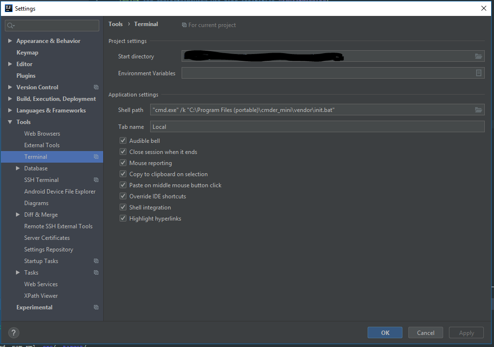

# How to add cmder to intelliJ idea

> Download cmder terminal at following address
https://cmder.net/

> Create folder (Program Files (portable)) in C drive

> Inside intelliJ
> Go to File > settings > Tools > Terminal
> Inside Shell path textbox, enter following line

> "cmd.exe" /k "C:\Program Files (portable)\cmder_mini\vendor\init.bat"

> Restart intelliJ

 